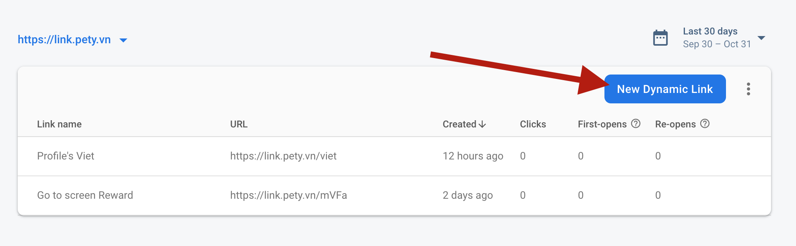
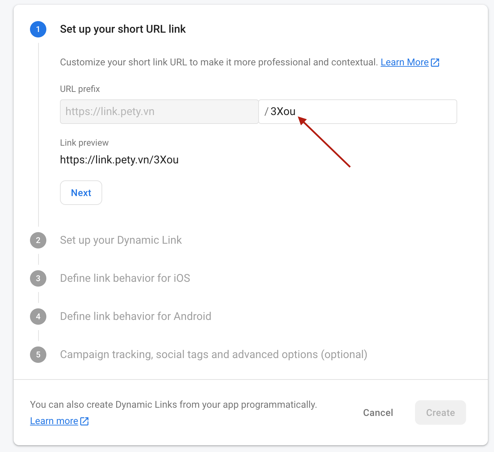
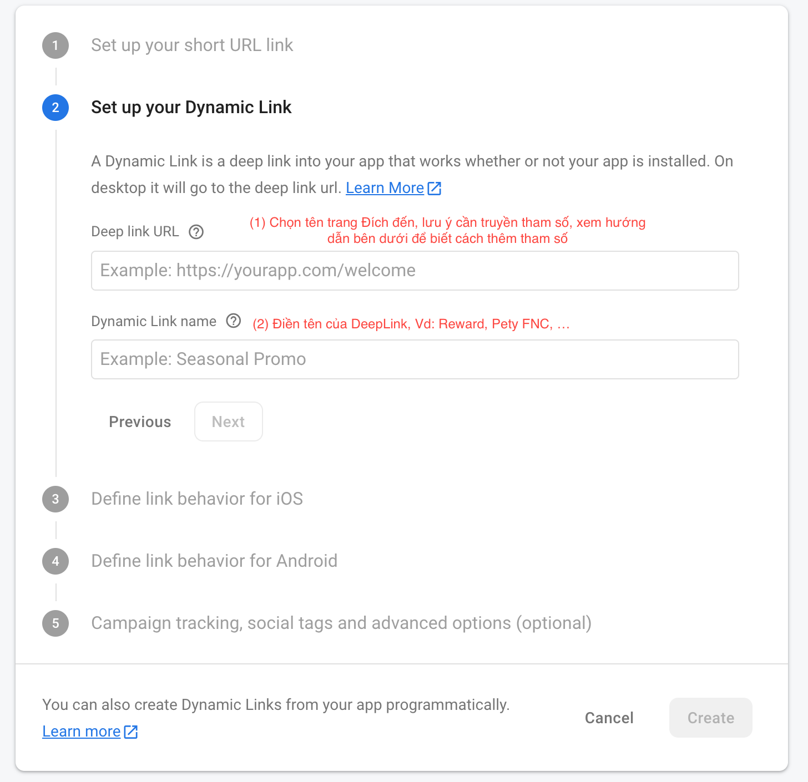
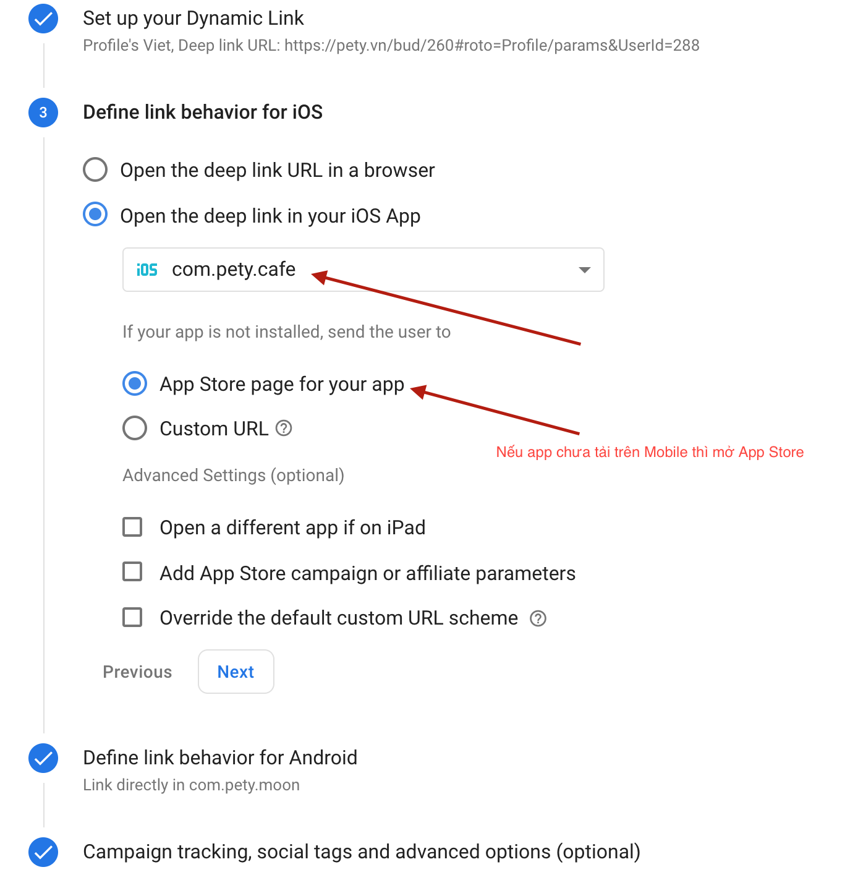
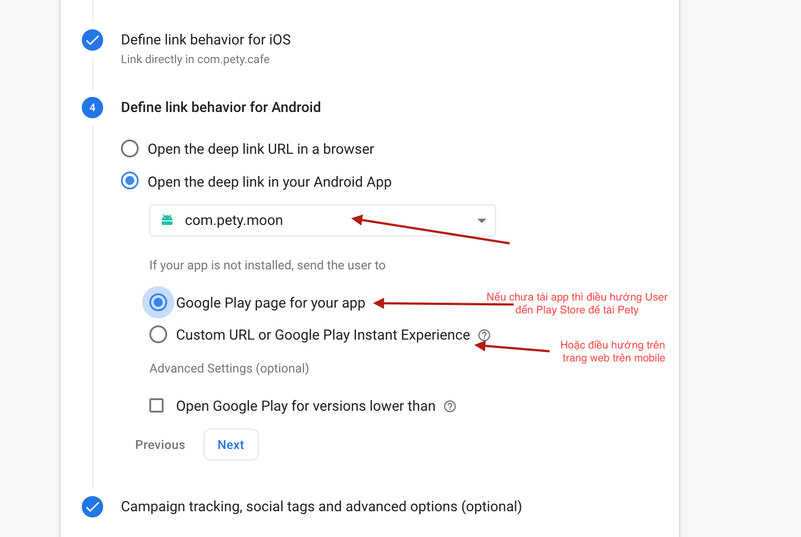
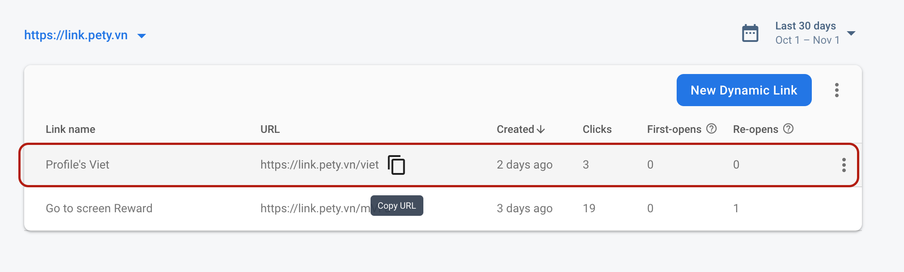

# Sử dụng Dynamic link cho Pety

1. Vào trang [**Firebase console**](https://console.firebase.google.com/project/pety-30b47/durablelinks/links/https:~2F~2Flink.pety.vn)

> Chú ý chọn domain: _link.pety.vn_ để tạo domain mới

2. Chọn **New Dynamic Link**

   

3. Tiến hành tạo Link mới.

   

> Lưu ý: Đuôi **_3Xou_** có thể thay đổi được theo từng Campain

Ví dụ: link.pety.vn/invite, link.pety.vn/promo,..

### Click **Next**

4. Set up your Dynamic Link

   

> Lưu lý cách truyền tham số để DynamicLink có thể dẫn vào đúng màn hình trong App:

## Deep link URL:

Ví dụ ta có 1 đường link:

https://pety.vn/blog/ung-dung-danh-rieng-cho-nguoi-yeu-thu-cung-day-roi.html

### 4.1 Vào trang Pet profile

Để Dynamic link có thể mở ứng dụng Pety và vào trang 1 con Pet thì ta cần thêm vào sau đuôi đường dẫn link như sau:

```
#roto=pet/<PetId>/<OwnerId>
```

Trong đó:

- **_PetId_** là Id của con Pet trong Database

- **_OwnerId_** là Id của chủ con Pet trong Database

Để biết được PetId và OwnerId thì liên hệ các anh Developer **_đẹp trai_**

Ví dụ: https://pety.vn/blog/ung-dung-danh-rieng-cho-nguoi-yeu-thu-cung-day-roi.html#roto=pet/806/288

### 4.2 Vào màn hình của 1 User bất kỳ

Để Dynamic link có thể mở ứng dụng Pety và vào trang 1 User bất kỳ thì ta cần thêm vào sau đuôi đường dẫn link như sau:

```
#roto=Profile/<UserId>
```

Trong đó:

- **_UserId_** là Id của con User trong Database

Để biết được UserId thì liên hệ các anh Developer **_đẹp trai_**

Ví dụ: https://pety.vn/blog/ung-dung-danh-rieng-cho-nguoi-yeu-thu-cung-day-roi.html#roto=Profile/288

### 4.3 Vào màn hình của 1 bài viết bất kỳ

Để Dynamic link có thể mở ứng dụng Pety và vào trang 1 bài viết bất kỳ thì ta cần thêm vào sau đuôi đường dẫn link như sau:

```
#roto=Post/<PostId>
```

Trong đó:

- **_PostId_** là Id của bài Post trong Database

Để biết được PostId thì liên hệ các anh Developer **_đẹp trai_**

Ví dụ: https://pety.vn/blog/ung-dung-danh-rieng-cho-nguoi-yeu-thu-cung-day-roi.html#roto=Post/11756

### 4.4 Vào màn hình của 1 màn hình bất ký

Để Dynamic link có thể mở ứng dụng Pety và vào trang 1 màn hình bất kỳ thì ta cần thêm vào sau đuôi đường dẫn link như sau:

```
#roto=<Key màn hình>/params& <key> = <value> & <key> = <value> ...
```

Trong đó:

- **_Key màn hình_** là Id của màn hình code mobile(file Route.js)

- **_key, value_** là key và giá trị của tham số trong màn hình truyền vào

> Lưu ý: \
> Để vào màn hình bất kỳ thì nên liên hệ các anh Coder đẹp trai trong teaam để lấy tham số truyền vào.\
> Truyền sai tham số có thể gây crash và gây lỗi cho màn hình đó.

Ví dụ: https://pety.vn/blog/ung-dung-danh-rieng-cho-nguoi-yeu-thu-cung-day-roi.html#roto=Reward/params&UserId=208&PetId=806

### 5. Define link behavior for iOS

Cài đặt Dynamic link cho iOS



### 6. Define link behavior for Android

Cài đặt Dynamic link cho Android



### 7. Campaign tracking, social tags and advanced options

Thiết lập các chỉ số tracking cho Campaign
Điền các chỉ số Tracking, tên gọi phù hợp cho từng Campain để có thể phân tích, đưa ra kết luận dễ dàng hơn.

XONG NGON NGHẺ, ta có thể mang Dynamic này đi sử dụng và có thể quan sát các chỉ số Tracking ngay bên cạnh.


